# MATCHA

## SUMMARY
- [Introduction](#introduction)
- [Previews](#previews)
- [Installation](#installation)
	- [1 - Front](#1---front)
	- [2 - Back](#2---back)
- [Stack](#stack)
- [More about the Project](#more-about-the-project)
- [General Working](#general-working)
- [Project Constraints](#subject-constraints)
- [Subject Details Registration and Signing-in](#subject-registration-and-signing-in)
- [Subject Details User profile](#subject-user-profile)
- [Subject Details Browsing](#subject-browsing)
- [Subject Details Research](#subject-research)
- [Subject Details Profile of other users](#subject-profile-of-other-users)
- [Subject Details Chat](#subject-chat)
- [Subject Details Notifications](#subject-notifications)
- [API Routes List](#api-routes)
- [Ending](#ending)

## INTRODUCTION

**Second** project of the 42 school **web branch.**

This project is about creating a **dating website.**

This app allowing two potential lovers **to meet,**
from the **registration** to the **final encounter.**

A user will then be able to **register**, **connect**, **fill his/her profile**, **search** and **look into the profile of other users**, **like them 1**, **chat** with those that “liked” back, so **build properly** a tinder like app in my second web project. Yes, it's possible, **everything is possible** at **42** school.

So for a second web project, this is a really complex project with many, many things to do, and to learn.

 I created the **REST API** from scratch, and **containerized** the  whole **API**, and the **front** too. 
(If you interested by docker, I wrote two articles about it [here](https://medium.com/@remyc) and validate the docker project of 42 [here](https://github.com/rcrestey/42_docker-1/))

Honestly, it was **really hard,** because,  I needed to **learn modern web architecture from scratch,** what is an API, a REST API, express.js , postgresql, typescript and many other things: **it's when you challenge yourself that you grow up.** 

## PREVIEWS
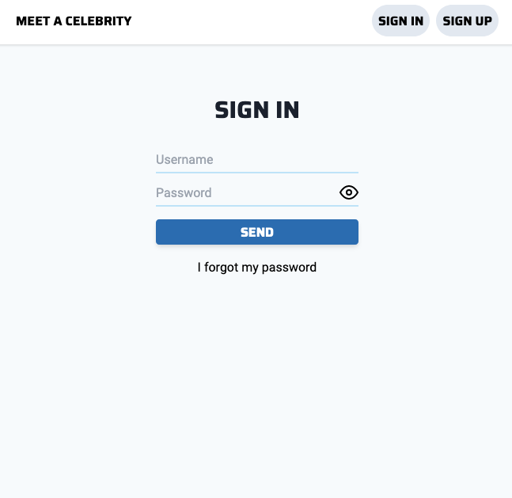
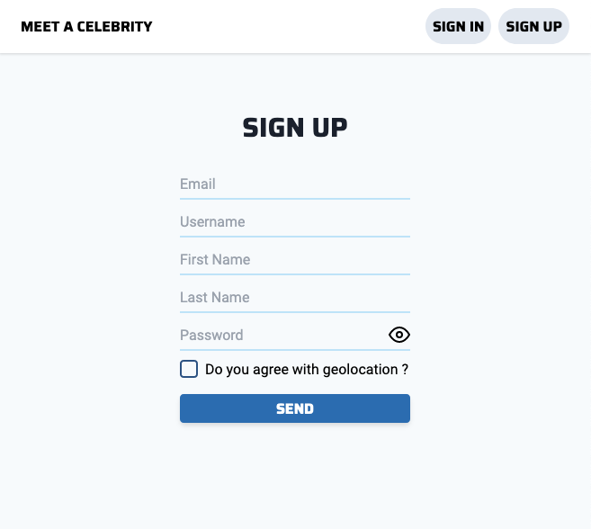
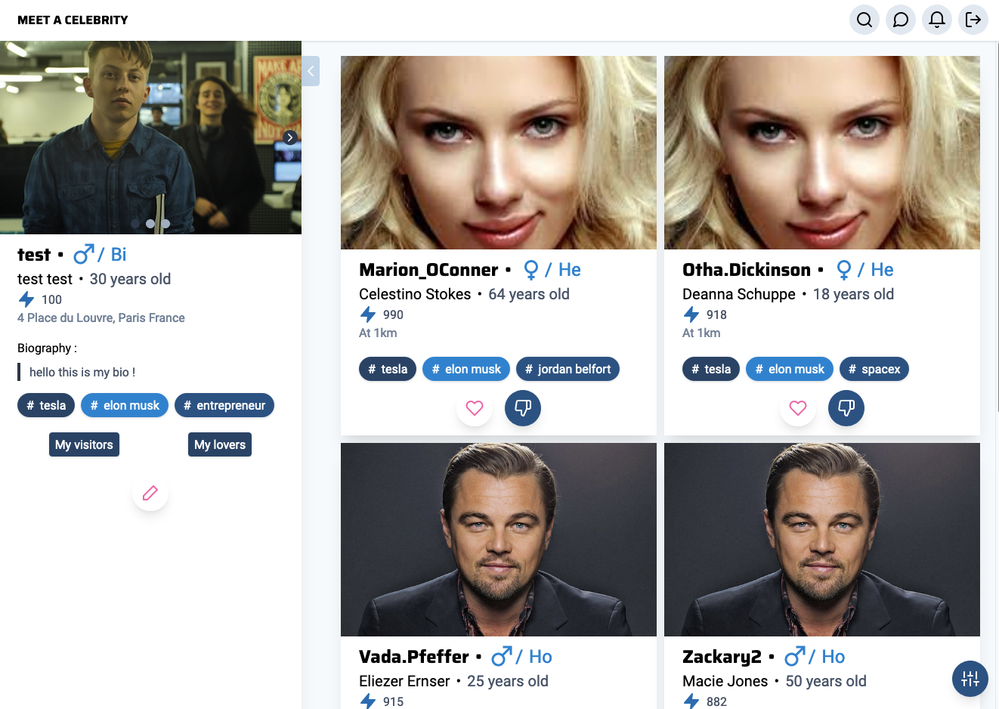
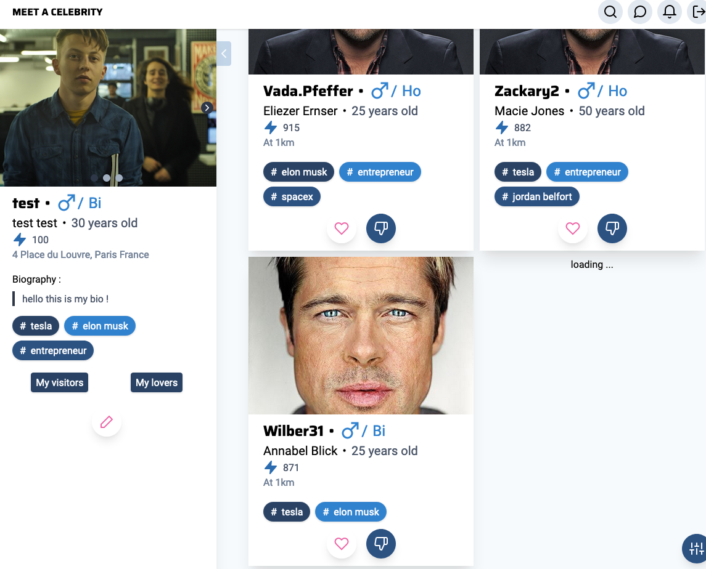
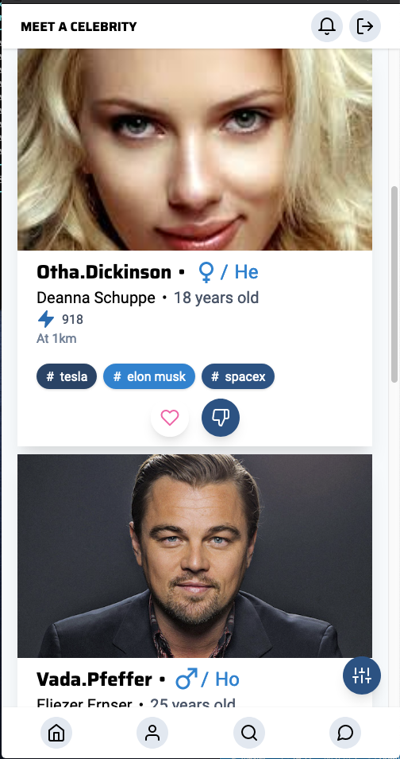
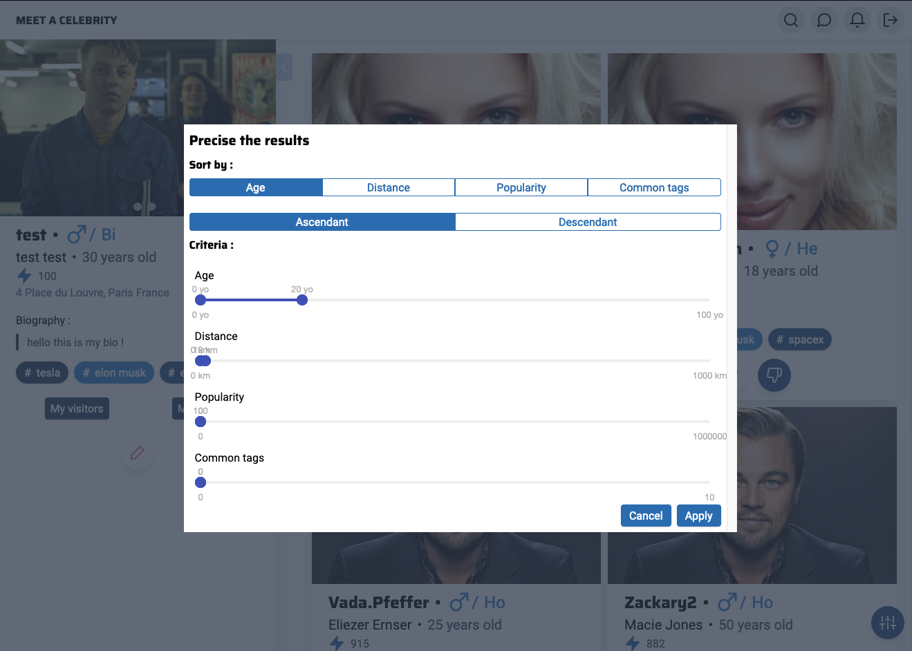
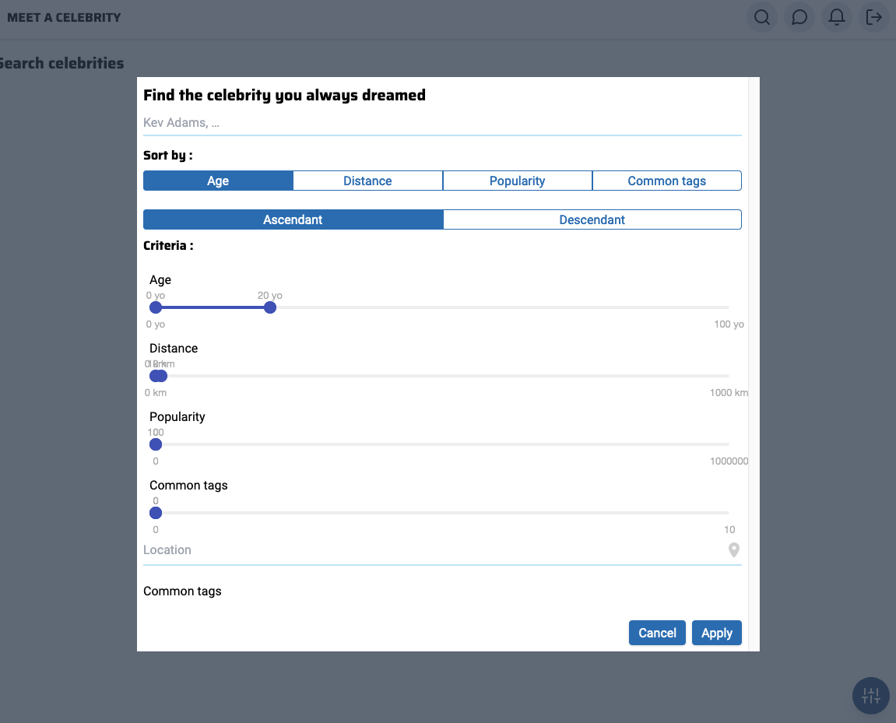
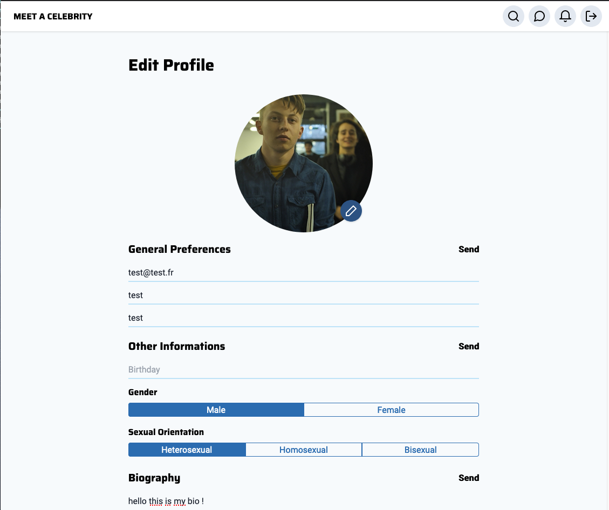
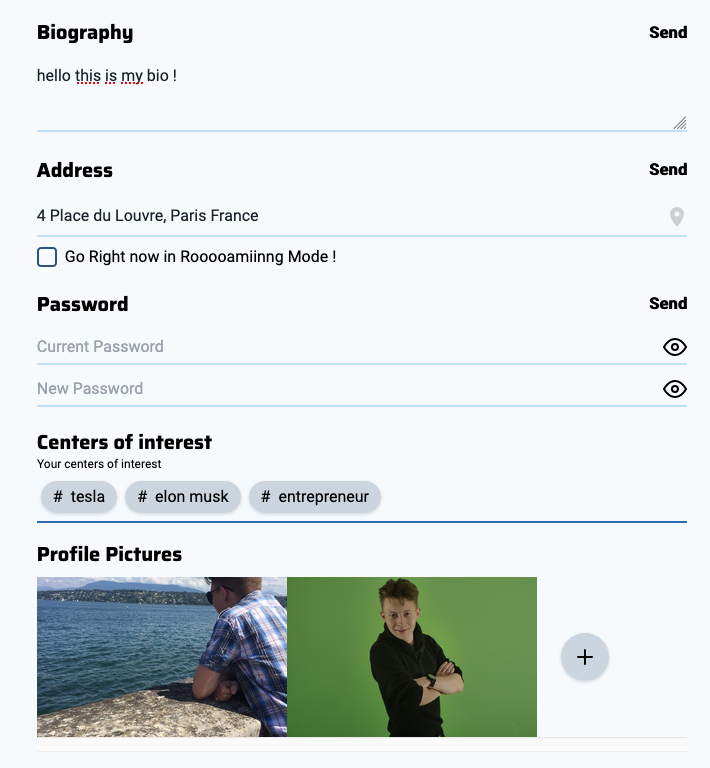
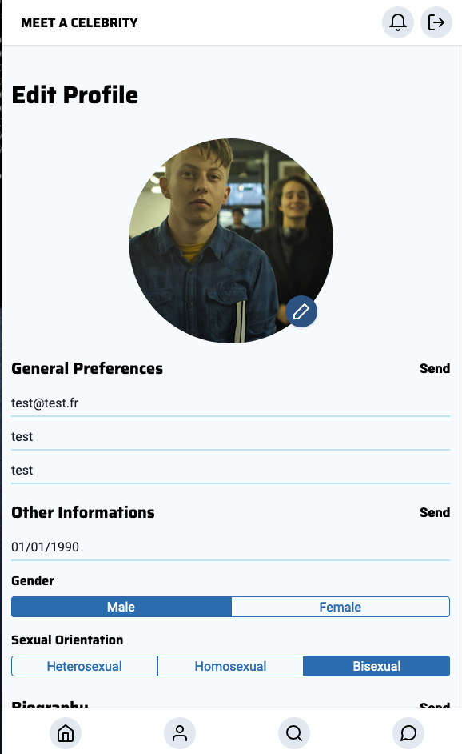
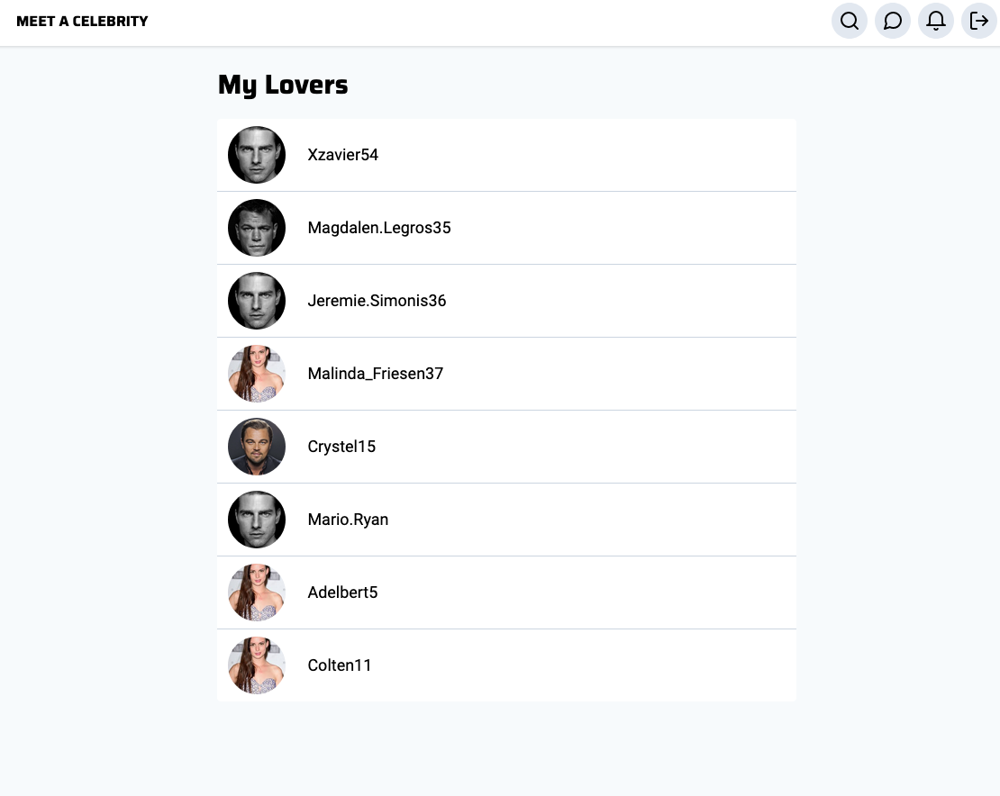
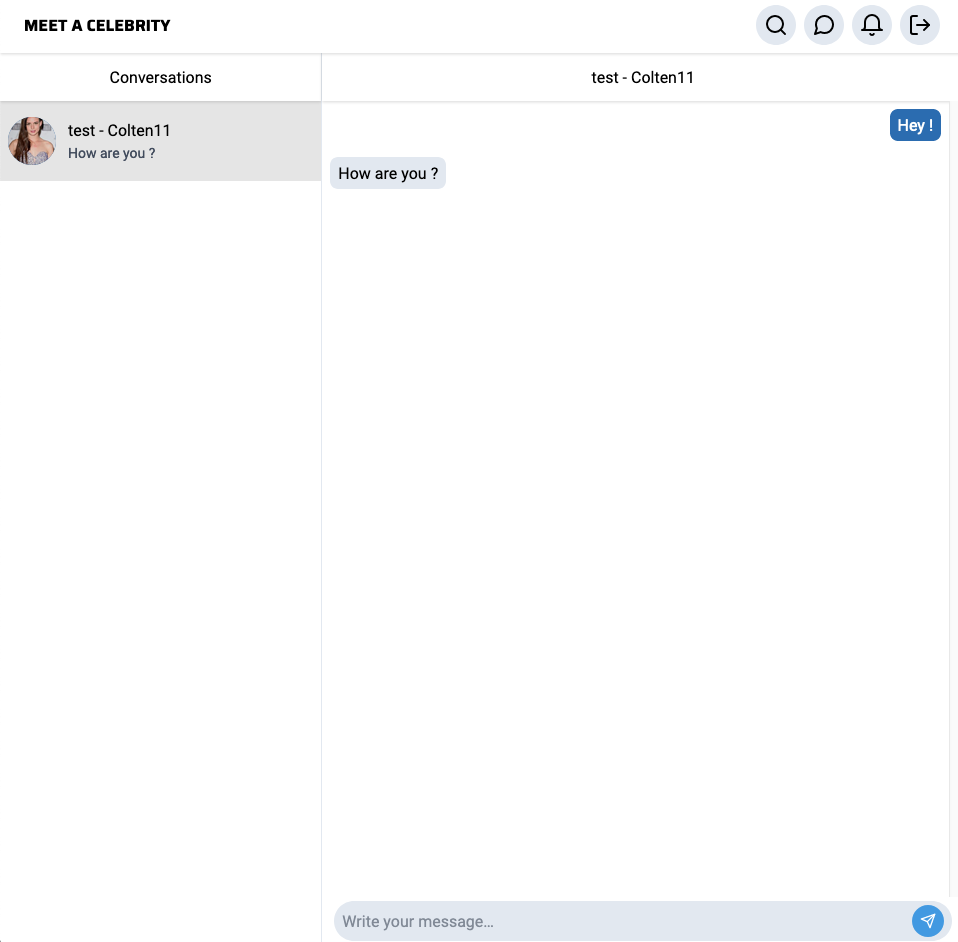
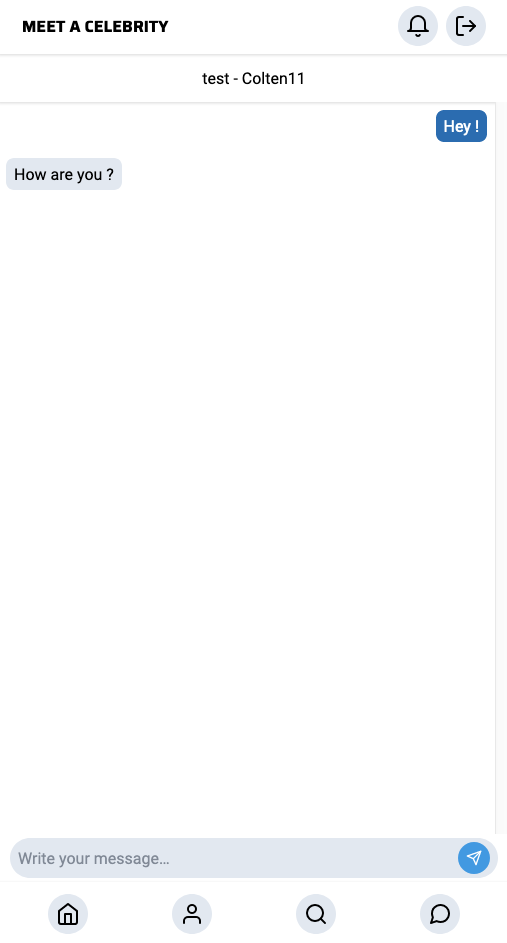
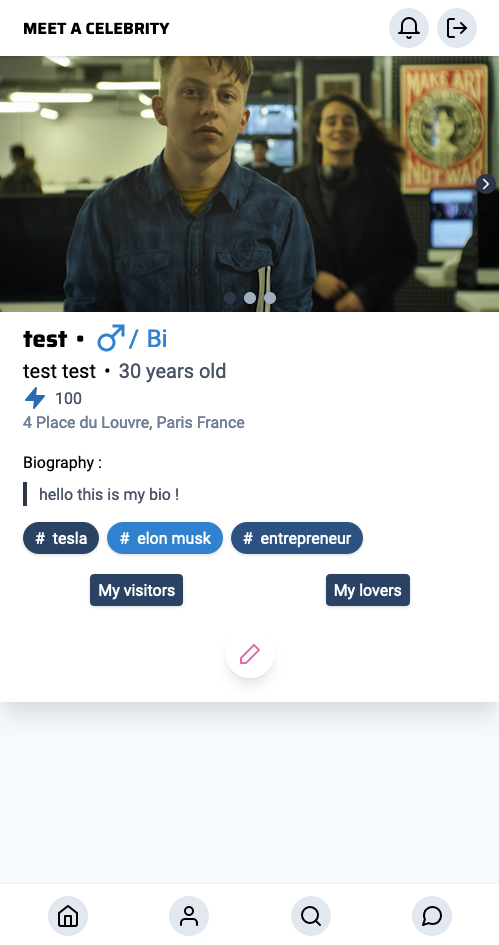

## INSTALLATION
#### 1 - FRONT
- DEV
	- Install packages: `npm i`  
	- start **front**: `npm start` 
- PROD
	- start **front container**: `docker run -it --name front -p 3000:3000 front` 

#### 2 - BACK
- DEV
	- Install packages: `npm i`
	- Start **API**: `npm start`
	- Start **DB**: `docker-compose up database`
	- Start **Cloud**: `docker-compose up cloud`
	- Set up Cloud (if first container starting): `docker-compose up setupCloud`
	 
- PROD
	- `docker-compose up` 
- SEED
	- DEV: `npx ts-node -r dotenv/config back/seed/seed.ts`
	- PROD: `docker-compose exec  api npx ts-node -r dotenv/config seed/seed.ts`

/!\ Don't forget to fill **.env** files in front and back folder (*docker machine ip* and *api keys* are **required**, but you can set up all the other params as you wants ;) )

## STACK
##### FRONT-END:
- react
- react-dom
- Docker

##### BACK-END:
- express.js
- typescript
- Postgres (with pl/pgsql functions)
- Docker
- WebSocket

## More about the Project

This project is composed of 8 big parts: 
- **Account** part (Sign-in, sign-up, password reset, email conf etc ...)
- **User** part ( User profile, profile edition, preferences, like and visits history etc ...)
- **External User** part (Show external profile, likes button, don't like, block, report etc ...)

- **Suggestion** part: Like tinder, suggest to the user **more appropriates users** in function of many, many criteria like, **location**, **interest**, **common tags**, **popularity score** etc etc. And the whole **filterable** and **sortable** by all this criteria

	If you interested in **how I build that**, check `back/db/functions.sql`, main function named **"proposals"**. I created many **pl/pgsql procedural functions,** called in the main function: **proposals**. 
	
	Else you do something really horrible: do many queries from your API, surcharge your DB, not optimizing your query, increasing time computing of the DB etc... 
	
	If you want to **learn more about** pl/pgsql functions, I write a big **article about it** just [here](https://medium.com/@remyc/pl-pgsql-la-formule-1-de-postgresql-29ff40890612) .
	You will learn you the **ins** and **outs** of **pl/pgsql** functions (cause is so powerful) 

- **Search** part: Like previous part, but instead of suggest users to the connected user, he can **search by itself** and **filter** and **sort** the results by all the criteria. (I done pl/pgsql functions for doing that too ;) )

- **Chat** Part: When users liked each others, a **conversation magically appears**, and user can chat. ( realized with **WebSocket** protocol )

- **Notification** part: This app contains **his own notifications workflow** with **WebSocket** protocol too, notify user when someone like is profile, user match, users see the profile etc etc ... (More details below)

- **Seed** part: **Generate randomly fake profiles** (for example, 1000 for the correction at 42, but you can set the number that you want, just a const in the script to set). 

	So this part is composed of **two sub-part**:
	- The first **generates fake users**, and put the whole **in a file**
	- The second **hydrate** the db with the **previously generated file**. 

So you can imagine, that for a beginner, have a project like this for a second web project **may scare** you a little, but the thing is **to go despite everything**, and **use your fear** to **advance** much faster instead of staying in place.
 I have the opportunities to **learn so much**, to grow really well my skills (about the web, but also about project management with my "colleague").
 So I encourage you, if you want to learn faster, to **really challenge** yourself with **big projects** like it and do it **much properly that you can**. (But with good partners if you could ;)

## General Working

So how it's work? 

I will not be able to go into details, else I write 10 pages.

What could be **intelligent** and **efficient**, is to share with you the **global vision** of the project, how the **cloud** communicates with the **front**, the front with the **API,** the **docker containerization** etc. etc.
And if you are more specific request, questions, whatever, **contact me**.
I'll illustrate the all with the schema bellow, followed by little explanation part.

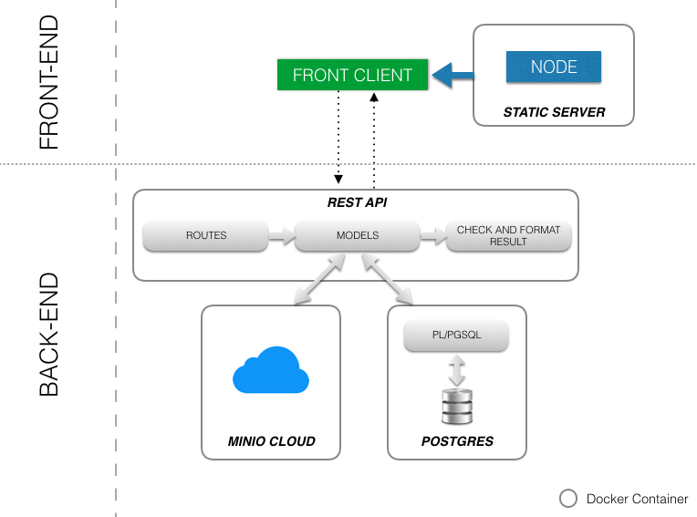

### 1 - Front part

The **front** has is own **node server** with own routes (Thanks to **react-dom**), it's a **react app**. And this node server is **containerized with docker.**
This container can run **everywhere** in the world as long as the back-end address is set in the .env file 

### 2 - Back part

So, the **back-end** is composed of **3 parts** who communicates together: the **API**, the **database**, and the **cloud**(for no textual datas).
This 3 parts run in **their own docker containers**, and can be managed by **docker-swarm** or **kubernetes** for example.
And Every container is accessible from outside.
Like that, we can connect securely to our database, cloud, API and **managed them from everywhere**.

For more details, the **API** is organised in **routes**.
Every route calls **models functions**.
Model functions does **specifics CRUD  actions** (Create, Read, Update, Delete)  on Database thanks to **simple queries** if it's little actions, **or** call **Pl/pgsql functions** if operations are more complex. (Like the users suggestions, for example).

So this is the main part of the working.
If you want to know more, check the code.
If you have a specific question, contact me ;)

## Subject Constraints
- For this project you are free to use the language you want.

-   You can use micro-frameworks, and all the libraries in the world for this project.

-   We will consider that a “micro-framework” has a router, and eventually templating, but no ORM, validators or User Accounts Manager. As long as you respect these constraints you are free to use what you like.

-   If you need some inspirations, we will suggest as main languages:
	-  Sinatra for Ruby.  
	-  Express for Node (yes, we consider this to be micro-framwork).  
	- Flask for Python.  
	-  Scalatra for Scala. 
	- Slim for PHP (Silex is not authorized because of doctrine integration). 
	- Nickel for Rust.  
	-  Goji for Golang.  
	-  Spark for Java.  
	-  Crow for C++.

-   You’re free to use the web server you like most may it be Apache, Nginx or a built-in web server.
    
-   Your whole app must be compatible at least with Firefox (>= 41) and Chrome (>= 46).
    
-   Your website must have a decent layout: at least a header, a main section and a footer.
    
-   Your website must be usable on a mobile phone and keep an acceptable layout on small resolutions.

- All your forms must have correct validations and the whole website must be secure. This part is mandatory and will be checked extensively in defense. To give you an idea, here are a few elements that are not considered secure:

	- To have a “plain text” password stored in your database.  
	- To be able to inject HTML of “user” Javascript code in unprotected variables. 
	- To be able to upload unwanted content.  
	- To be able to alter a SQL request.

- You can ask your questions on the forum, on slack.

## Subject Registration and Signing-in

- The app must allow a user to register asking at least an email address, a username, a last name, a first name and a password that is somehow protected. After the registration, an e-mail with an unique link must be sent to the registered user to verify his account.

- The user must then be able to connect with his/her username and password. He/She must be able to receive an email allowing him/her to re-initialize his/her password should the first one be forgotten and disconnect with 1 click from any pages on the site.

## Subject User profile

-   Once connected, a user must fill his or her profile, adding the following information:
    
    -   The gender.
        
    -   Sexual preferences.
        
    -   A biography.
        
    -   A list of interests with tags (ex: #vegan, #geek, #piercing etc...). These tags must be reusable.
        
    -   Pictures, max 5, including 1 as profile picture.
        
-   At any time, the user must be able to modify these information, as well as the last name, first name and email address.
    
-   The user must be able to check who looked at his/her profile as well as who “liked” him/her.
    
-   The user must have a public “fame rating” 1.
    
-   The user must be located using GPS positioning, up to his/her neighborhood. If
- The user does not want to be positioned, you must find a way to locate him/her even without his/her knowledge.
 - The user must be able to modify his/her GPS position in his/her profile

## Subject Browsing

The user must be able to easily get a list of suggestions that match his/her profile.

-   You will only propose “interesting” profiles for example, only men for a heterosexual girls. You must manage bisexuality. If the orientation isn’t specified, the user will be considered bi-sexual.
    
-   You must cleverly match profiles:
    
    - Same geographic area as the user.
    -  With a maximum of common tags. 
    - With a maximum “fame rating”.
    
-   You must show in priority people from the same geographical area.
    
-   The list must be sortable by age, localization, “fame rating” and common tags.
    
-   The list must be filterable by age, localization, “fame rating” and common tags.

## Subject Research

The user must be able to run an advanced research selecting one or a few criteria such as:
-  A age gap.  
- A “fame rating” gap. 
- A location.  
- One or multiple interests tags.
 
 As per the suggestion list, the resulting list must be sortable and filterable by age, location, “fame rating” and tags.

## Subject Profile of other users

A user must be able to consult the profile of other users. Profiles must contain all the information available about them, except for the email address and the password.

When a user consults a profile, it must appear in his/her visit history. The user must also be able to:

- If he has at least one picture “like” another user. When two people “like” each other, we will say that they are “connected” and are now able to chat. If the current user does not have a picture, he/she cannot complete this action.

-   Check the “fame rating”.
    
-   See if the user is online, and if not see the date and time of the last connection.
    
-   Report the user as a “fake account”.
    
-   Block the user. A blocked user won’t appear anymore in the research results and won’t generate additional notifications.
    
A user can clearly see if the consulted profile is connected or “like” his/her profile and must be able to “unlike” or be disconnected from that profile.

## Subject Chat

When two users are connected, they must be able to “chat” in real time. How you will implement the chat is totally up to you. The user must be able to see from any page if a new message is received.

## Subject Notifications
A user must be notified in real time of the following events:

- The user received a “like”.  
-  The user’s profile has been checked.
-  The user received a message.  
-  A “liked” user “liked” back.  
-  A connected user “unliked” you.

A user must be able to see, from any page that a notification hasn’t been read.

## API Routes

- 1 - Auth
	- `/auth/sign-in` (POST) 
	- `/auth/sign-up` (POST)
	- `/auth/confirmation/:uuid/:token` (GET) -> Account email validation
	- `/auth/reset-password/asking` (POST)
	- `/auth/reset-password/changing` (POST)
	
	- `/auth/logout` (GET)
- 2 - Profile
	- `/profile/general` (PUT) -> Set General Infos (username, first name etc ...)
	- `/profile/password` (PUT) ->  Set Password
	- `/profile/extended` (PUT) -> Set Extended profile (birth, sexual orientation etc ...)
	- `/profile/biography`(PUT)
	- `/profile/address` (PUT) -> Set address manually
	- `/profile/address/position` (PUT) -> Set address automatically with given latitude and longitude, generating right text address
	- `/profile/address/delete` (DELETE)
	- `/profile/location` set current location of the user (/!\ address is different !)
	- `/profile/tags/add` (PUT) -> Set tag for a user, create it if it's a new tags
	- `/profile/tags/delete` (DELETE) -> Unlink tag of a user, and delete it if it's not used
	- `/profile/tags` (GET) -> Get all tags of the user
	- `/profile/roaming` (PUT) -> Update roaming preferences of the user: if we see that the user is far from his location, we propose it to use his current location instead of his address
	- `/profile/profile-pics` (PUT) -> Update profile picture of the user, upload it in cloud.
	- `/profile/pics` (POST) -> Post other picture, limited to 5 by the subject
	
	- `/profile/pics` (DELETE) -> Delete a picture 
	
- 3 - Users
	- `/user/:uuid` (GET) -> Get the profile of external user by his uuid, and notify it of our visit.
	- `/user/like/:uuid` (POST) -> Like an user by his uuid and notify him .
	- `/user/not-interested/:uuid` (POST) -> Equivalent to right swap in tinder
	- `/user/unlike/:uuid` (POST) -> Unlike an user by his uuid and notify him .
	- `/user/block/:uuid` (POST) -> Block an user by his uuid and notify him .
	- `/user/report/:uuid` (POST) -> Report an user by his uuid.
	
	- `/user/visits/history/:limit/:offset` (GET) -> Get visits history of connected user.
	- `/user/likes/history/:limit/:offset` (GET) -> Get likes history of connected user.
- 4 - Match 
	- `/match/proposals/:limit/:offset` (POST) -> Appropriated user suggestion following many criteria, like location, score, age, etc.... The whole sorted and filtered with an implementation of infinite scroll
	
	- `/match/search/:data/:limit/:offset` (POST) -> As above, but with a search field, including all criteria seen above!

	- `/match/interval` (GET) -> Get all criteria interval: for example, if the older person of your suggestion have 25, we will show 25yo instead of 100 in age filter criteria
	
## ENDING

Thanks for your interest.
Contact me if you have questions, or if want to talk about that !
See you ;)

